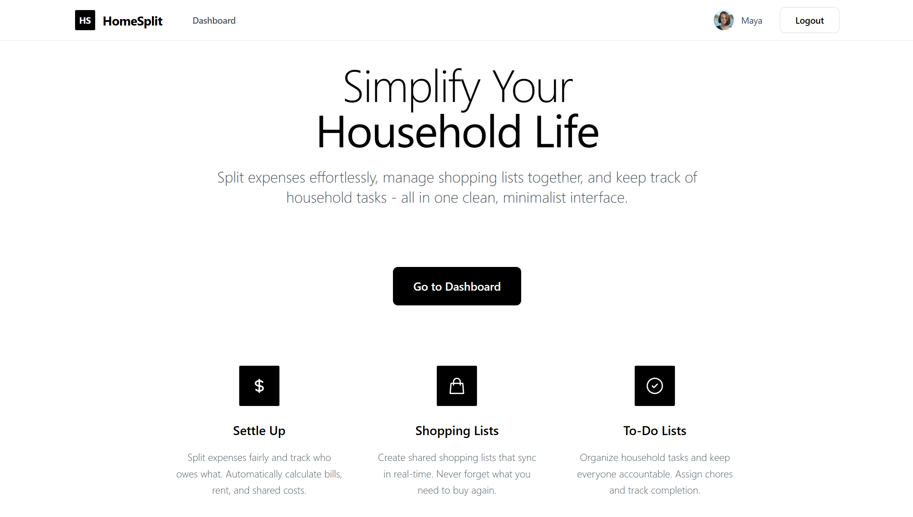
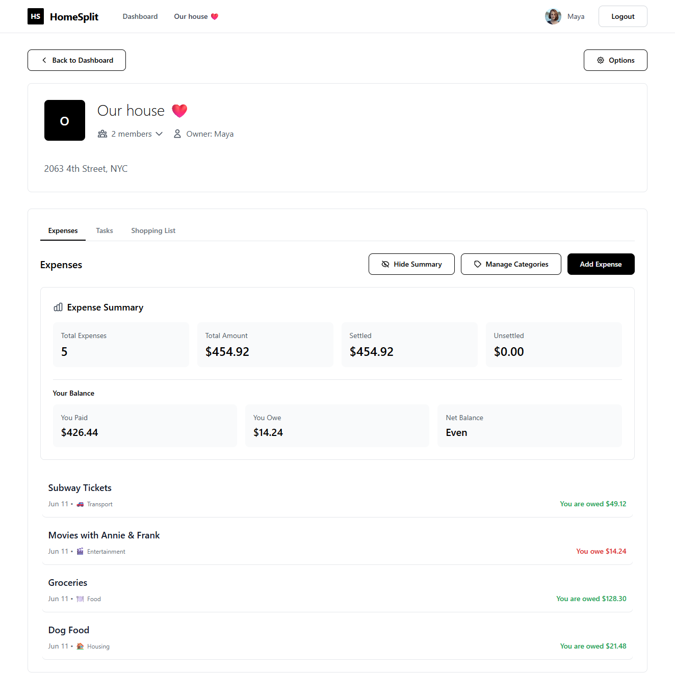

# HomeSplit - Household Management App

HomeSplit is a web application designed to simplify household managemnt by enabling users to track expenses, manage tasks, share responsibilities, and create shopping lists with other members.



## Features

- **💰 Expense Tracking** - Add expenses and split them automatically among household members
- **✅ Task Management** - Create and track household tasks with due dates
- **🛒 Shopping Lists** - Collaborative shopping lists that sync in real-time
- **👥 Household Management** - Create households and invite members to join
- **🔐 Secure Authentication** - User registration and login with JWT tokens
- **📱 Responsive Design** - Works seamlessly on desktop and mobile devices



## Technologies Used

### Backend
- **Django**: Python web framework
- **Django REST Framework**: Toolkit for building Web APIs
- **SQLite**: Lightweight database for development
- **JWT Authentication**: Secure user authentication

### Frontend
- **React**: JavaScript library for building user interfaces
- **TypeScript**: Superset of JavaScript for type safety
- **Tailwind CSS**: Utility-first CSS framework for styling
- **Axios**: Promise-based HTTP client for making API requests
- **React Router**: Declarative routing for React applications
- **Vite**: Build tool for modern web projects

## Project Structure

```
home-split/
├── backend/               # Django backend
│   ├── api/               # API application
│   │   ├── models/        # Database models
│   │   ├── serializers/   # API serializers
│   │   ├── views/         # API views
│   │   └── migrations/    # Database migrations
│   ├── algorithms/        # Business logic (settlements)
│   ├── backend/           # Django project settings
│   └── manage.py          # Django management script
└── frontend/              # React frontend
    ├── src/               # Frontend source code
    │   ├── components/    # Reusable UI components
    │   ├── pages/         # Page components
    │   ├── context/       # React context providers
    │   ├── services/      # API service layer
    │   └── types/         # TypeScript type definitions
    └── package.json       # Frontend dependencies
```

## Getting Started

### Prerequisites

- Python 3.8+
- Node.js 16+
- npm or yarn

### General Project Setup

1. Clone the repository:
    ```bash
    git clone https://github.com/diffiii/home-split
    ```

2. Navigate to the project directory:
    ```bash
    cd home-split
    ```

### Backend Setup

1. Navigate to the `backend` directory:
    ```bash
    cd backend
    ```

2. Create a virtual environment:
    ```bash
    python -m venv env
    ```

3. Activate the virtual environment:
    - On Windows:
        ```bash
        .\env\Scripts\activate
        ```
    - On macOS/Linux:
        ```bash
        source env/bin/activate
        ```

4. Install backend dependencies:
    ```bash
    pip install -r requirements.txt
    ```

5. Apply migrations to set up the database:
    ```bash
    python manage.py migrate
    ```

6. Start the Django development server:
    ```bash
    python manage.py runserver
    ```

The backend API will be available at `http://localhost:8000/api/`.

### Frontend Setup

1. Navigate to the `frontend` directory:
    ```bash
    cd frontend
    ```

2. Install frontend dependencies:
    ```bash
    npm install
    ```
    or
    ```bash
    yarn install
    ```

3. Start the development server:
    ```bash
    npm run dev
    ```
    or
    ```bash
    yarn dev
    ```

The frontend will be available at `http://localhost:3000/`.

### Sample Data

To quickly set up the database with sample data, you can run the following command in the backend directory:

```bash
cd backend
python manage.py loaddata ../data/sample_data.json
```

In case you experience issues with the sample data encoding, you can use the following command to load the data with UTF-8 encoding:

```bash
cd backend
python -Xutf8 manage.py loaddata ../data/sample_data.json
```

This will populate the database with predefined households, users, expenses, tasks, and shopping lists for testing purposes. 

You can use two predefined users:

- **User 1**: 

    `email: maya@smith.com`, `password: testing321`

- **User 2**: 

    `email: kinny@jones.us`, `password: testing321`

### API Endpoints

The list of available API endpoints can be found at `http://localhost:8000/api/docs/` once the backend server is running. This includes endpoints for user authentication, expense tracking, task management, and more.

## Licence

This project is licensed under the GPL-3.0 License - see the [LICENSE](LICENSE) file for details.
